# Android Virtual Device (AVD) Manager

AVD Manager GUI for Visual Studio Code.

Launch Android Emulator and manage SDK packages without touching the Android Studio😎

Also, welcome to open the issue any about this extension.

inspired by [oognuyh/vscode-android-emulator-helper](https://github.com/oognuyh/vscode-android-emulator-helper)

## Features

### AVD Manager

* AVD create, rename, delete, detail view

### SDK Platforms / Tools

* packages Install, update, delete
* accept SDK licenses

### Emulator

* Launch AVD

## Setup Android SDK

### Requirement
- Install JDK 21 (OpenJDK)

### Steps

1. Create Folder for the `SDK Root Path`  (E.g. C:/android/sdk)
2. Create `cmdline-tools` folder inside the SDK Root
   (E.g. C:/android/sdk/cmdline-tools)
3. Download `Android SDK Command-line Tools`
   [https://developer.android.com/studio#command-line-tools-only](https://developer.android.com/studio#command-line-tools-only)
4. Extract the files. You may get a folder call `cmdline-tools` and rename to `latest`
5. Move `latest` folder to cmdline-tools Folder
   E.g. C:/android/sdk/cmdline-tools/latest

### Folder Structure

* C:/android/sdk/ (SDK Root)
  * cmdline-tools
    * latest (download from android.com)
      * lib
      * bin
        * avdmanager
        * sdkmanager

Remember update `avdmanager.sdkPath` to Android SDK Root Path
It should work fine, if the folder structure is correct.

### Setup guide
# Setup Guide for sharing the SDK to Android Studio, VSCode and VSCode-like tools (E.g. VSCodium)

## Requirement
- Install JDK 8 (Oracle JDK or OpenJDK)

## Preparing the SDK

1. Assume that everything will place in the folder `C:\android-sdk`.
Create folder `C:\android-sdk` and `C:\android-sdk\cmdline-tools`.
    ```
    mkdir C:\android-sdk
    mkdir C:\android-sdk\cmdline-tools
    ```

2. download the SDK command line tool (e.g. `commandlinetools-win-9477386_latest.zip`) from below link
https://developer.android.com/studio#command-line-tools-only

3. open commandlinetools-win-9477386_latest.zip, you will see the `cmdline-tools`


4. unzip and rename the folder name from `cmdline-tools` to `latest`

5. move the `latest` to `C:\android-sdk\cmdline-tools`.
The SDK folder will be like below
    ```
    C:\android-sdk
    └─cmdline-tools
        └─latest
            ├─lib
            └─bin
              ├─avdmanager.bat
              └─sdkmanager.bat
    ```

6. Set  the environment `ANDROID_HOME` to `C:\android-sdk`


## Setup the VSCode and VSCode-like tools (E.g. VSCodium)
1. install AVD Manager


2. Click the Android icon to open the AVD Manager


3. You may see below. Click `Download Emulator` to download the emulator


4. If you click download. Wait until you see the `output` showing the download 100%.


5. Restart your VSCode and open AVD manager

6. Complete


## Setup Android Studio

1. Open the Android Studio, Click `More Actions`, `SDK Manager`


2. On `Android SDK Location`, Click Edit


3. Change `Android SDK Location` to the SDK path (e.g. `C:\android-sdk`)


4. Click Next and complete the setup.


------


After all, the VSCode and Android Studio will share the same SDK tools.

## Extension Settings

### Required

* `avdmanager.sdkPath` : Android SDK Root Path
  The location of the Android SDK Root Path. If blank, it will attempt to find it from the `ANDROID_SDK_ROOT` or `ANDROID_HOME` environment variables.
* `avdmanager.cmdVersion`: Android SDK Command-Line Tools Version (default=latest)

After updating the SDK Path. The AVD Manager will auto lookup all executable paths from the SDK.

### Optional

* `avdmanager.avdmanager`: AVD Manager executable path
* `avdmanager.avdHome`: AVD Home path for AVDManager
* `avdmanager.sdkManager`: SDK Manager executable path
* `avdmanager.emulator`: Android emulator executable path
* `avdmanager.emulatorOpt`: Android emulator execute [options](https://developer.android.com/studio/run/emulator-commandline)

## Commands

* `avdmanager.pkg-update-all` : Update All SDK Package
* `avdmanager.pkg-accept-license` : Accept All SDK Licenses
* `avdmanager.setup-sdkpath` : Update SDK Root Path
* `avdmanager.setup-avdmanager` : Update AVDManage Path
* `avdmanager.setup-sdkmanager` : Update SDKManage Path
* `avdmanager.setup-emulator` : Update Emulator Path

## Screenshot

### AVD Manager

Create AVD [+ Button]

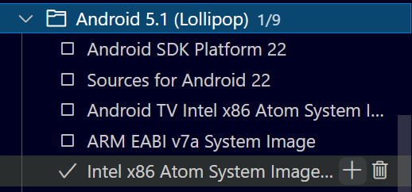

Create AVD - new AVD Name

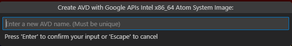

Create AVD - device selection

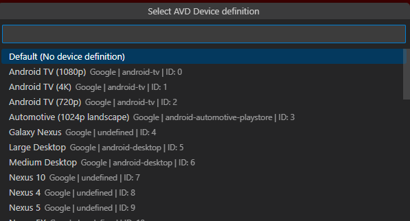


Rename AVD [Pen Icon Button]

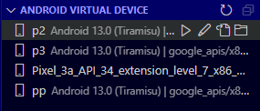

Open AVD config.ini  [File Button] and Open AVD config folder  [Folder Button]

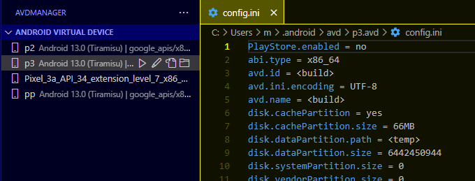

Delete AVD [Right Click on AVD Name]

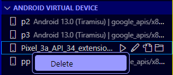


AVD Details [Mouseover on the AVD name]

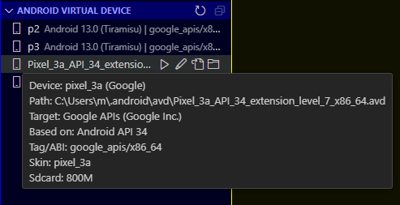

### SDK Platforms / Tools

Install packages (system-image, platforms, source-code)

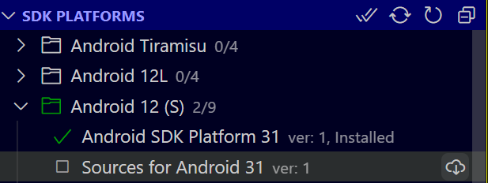

Install SDK Tools E.g. Build-tools, cmake, emulator, etc.

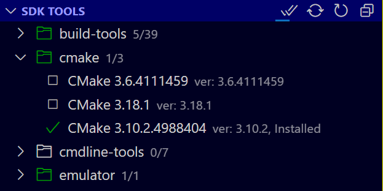

Package Detail

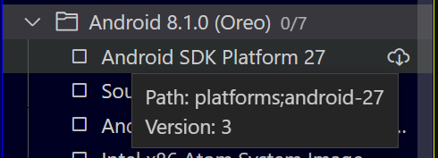

Accept All SDK licenses [Double Check icon Button]

Update All SDK Package [Sync icon button]


### Emulator

Launch AVD [Play icon Button]

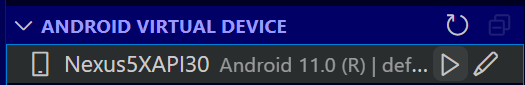

Emulator Log

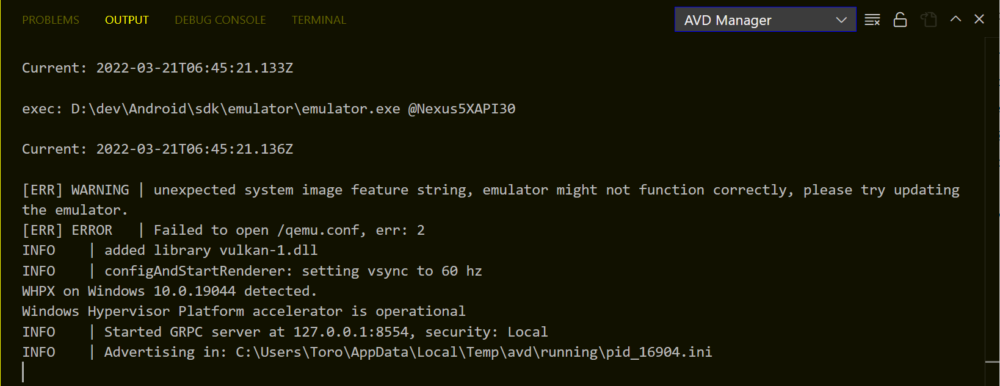
